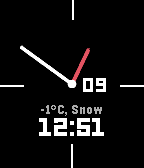
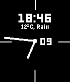
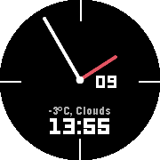

# Hybrid
My first watchface I made for the Pebble time, Pebble time steel, Pebble Time Round and Pebble 2 with rocky.js

Updates:
Update - Font was changed to a leco font style and the hour hand is now red

Update 2 - Weather API is now working.

Update 3 - Issues with quick view have been solved

Update 4 - Fixed the 12 hour issues

Update 5 - Now automatic switching between Celsius and Fahrenheit if the detects in if you are in the US

